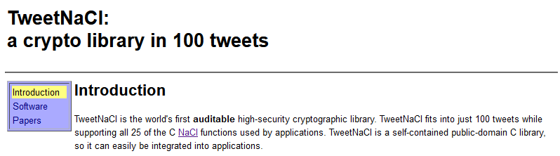

# Public Domain Notice

This is free and unencumbered software released into the public domain. MCCI Corporation ("MCCI") accessed the software on 2021-03-13 at which point it was accompanied by the following notice:

Anyone is free to copy, modify, publish, use, compile, sell, or distribute this software, either in source code form or as a compiled binary, for any purpose, commercial or non-commercial, and by any means.

In jurisdictions that recognize copyright laws, MCCI Corporation dedicates any and all copyright interest in the software to the public domain. MCCI makes this dedication for the benefit of the public at large and to the detriment of its heirs and successors. MCCI intends this dedication to be an overt act of relinquishment in perpetuity of all present and future rights to this software under copyright law.

THE SOFTWARE IS PROVIDED "AS IS", WITHOUT WARRANTY OF ANY KIND, EXPRESS OR IMPLIED, INCLUDING BUT NOT LIMITED TO THE WARRANTIES OF MERCHANTABILITY, FITNESS FOR A PARTICULAR PURPOSE AND NONINFRINGEMENT. IN NO EVENT SHALL THE AUTHORS OR MCCI CORPORATION BE LIABLE FOR ANY CLAIM, DAMAGES OR OTHER LIABILITY, WHETHER IN AN ACTION OF CONTRACT, TORT OR OTHERWISE, ARISING FROM, OUT OF OR IN CONNECTION WITH THE SOFTWARE OR THE USE OR OTHER DEALINGS IN THE SOFTWARE.

This license is based on the "Unlicense". For more information, please refer to <https://unlicense.org>
